# 健康管理后台状态机梳理

## 说明

本文基于当前后台原型图（`健康管理后台_优化版.html`）梳理"系统中真正有状态变化的核心对象"，用于帮助产品、研发和测试统一状态口径。

### 标注规则

1. `显式状态`：原型页面中直接出现的状态标签、badge 或开关。
2. `推断状态`：原型未直接写出，但根据页面动作、列表按钮和业务链路推导出的必要中间状态。
3. 如果后续产品确认与本文不同，应以正式 PRD 和接口字段字典为准。

### 本文聚焦的状态对象

1. 用户状态机
2. 用户方案实例状态机
3. 评餐记录状态机
4. 咨询会话状态机
5. 阶段报告状态机
6. 方案模板状态机
7. 营养师账号状态机
8. 消息推送记录状态机
9. 健康建议模板状态机
10. 异常预警规则状态机
11. 角色状态机
12. 食物/运动库条目状态机
13. 系统配置开关状态机

---

## 1. 用户状态机

### 来源

- [后台原型-用户列表]：`page-users`

### 状态定义

用户列表页通过筛选下拉「全部状态」直接展示以下四个状态标签：

| 状态 | 类型 | 说明 |
|------|------|------|
| `暂不减重` | 显式状态 | 列表 badge-gray |
| `方案执行中` | 显式状态 | 列表 badge-green |
| `已达标` | 显式状态 | 列表 badge-blue |
| `已流失` | 显式状态 | 列表 badge-red（`background:#FEE2E2`） |

> 移动端当前未做「暂停方案」与「推迟执行方案」功能，因此**本期不含 `已暂停` 状态**。后台原型的筛选中出现的"已暂停"为预留条目，待移动端支持暂停能力后重新激活。

### 触发事件

> 原型中未展示状态间的迁移操作入口，触发事件待产品 PRD 明确后补充。

### 约束规则

1. 用户列表筛选条件包含：全部BMI（偏瘦/正常/超重/肥胖）、全部营养师、全部状态。BMI 和营养师属于属性维度，不参与本状态机。
2. 各状态的定义、流转规则、终态判定条件待产品 PRD 明确。

---

## 2. 用户方案实例状态机

### 来源

- [后台原型-用户详情]：`page-user-detail`（方案状态区域）
- [后台原型-方案管理]：`page-plan-mgmt`（方案确认回执统计）
- [后台原型-方案生成引擎]：`page-plan-engine`（生命周期说明 + 调整弹窗 `modal-plan-adjust`）

### 状态定义

| 状态 | 类型 | 说明 |
|------|------|------|
| `系统生成中` | 推断状态 | 用户评测完成后，系统自动生成初始方案 |
| `待用户确认` | 显式状态 | 系统生成初始方案已推送，等待用户确认；方案管理页显示"待确认"badge-yellow |
| `执行中` | 显式状态 | 用户已确认方案，正在执行；用户详情页显示"方案执行中"badge-green |
| `调整中` | 推断状态 | 营养师正在调整方案但尚未推送（草稿态） |
| `调整后待确认` | 推断状态 | 营养师调整方案已推送，等待用户确认新方案 |
| `已完成` | 推断状态 | 服务周期结束或用户达标后方案自然结束 |

> 注：方案管理页还显示了"超时未确认"（badge-red），建议将其视为 `待用户确认` 状态下的一个时间维度的标签，而非独立状态。

### 触发事件

| 事件 | 从状态 | 到状态 |
|------|--------|--------|
| 系统根据评测生成初始方案 | `无方案` | `系统生成中` |
| 方案生成完毕并推送 | `系统生成中` | `待用户确认` |
| 用户确认方案 | `待用户确认` | `执行中` |
| 营养师创建调整草稿 | `执行中` | `调整中` |
| 营养师推送调整方案 | `调整中` | `调整后待确认` |
| 用户确认调整方案 | `调整后待确认` | `执行中` |
| 服务到期/达标 | `执行中` | `已完成` |
| 营养师放弃调整 | `调整中` | `执行中` |

### 约束规则

1. `调整中` 是营养师的草稿态，不应公开给用户端；营养师可随时放弃调整回到 `执行中`。
2. 每次调整需记录版本号，方案管理页展示的"已确认/待确认/超时未确认"统计是针对当前推送版本的确认回执。
3. 方案生成引擎页面的生命周期描述："用户评测 → 系统自动生成初始方案 → 用户确认 → 执行 → 营养师调整(记录版本) → 推送通知 → 用户确认新方案"，与本状态机一致。
4. 方案生成引擎的分档方案（肥胖档/超重档/正常档/偏瘦档）是**方案模板的属性**，不参与本状态机。

### Mermaid

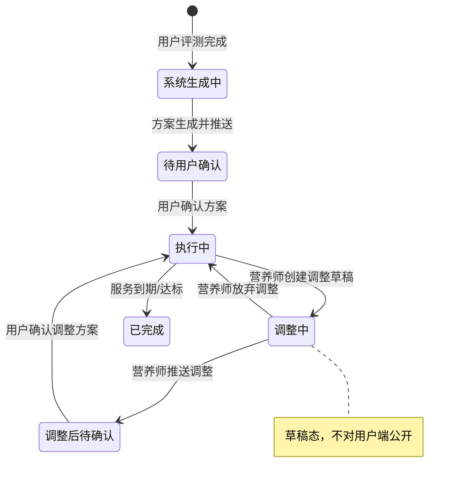

---

## 3. 评餐记录状态机

### 来源

- [后台原型-评餐管理]：`page-meal-review`
- [后台原型-用户详情]：`page-user-detail`（餐食记录中的评餐状态）
- [后台原型-工作台]：`page-dashboard`（评餐超时告警）

### 状态定义

| 状态 | 类型 | 说明 |
|------|------|------|
| `待评` | 显式状态 | 用户打卡后等待营养师评价；列表 badge-yellow；显示"立即评餐"按钮 |
| `超时` | 显式状态 | 超过规定时间未评价；列表 badge-red（显示"超时 Xh"）；Dashboard 告警 |
| `已评` | 显式状态 | 营养师已完成评价；列表 badge-green；显示"查看"按钮 |

### 触发事件

| 事件 | 从状态 | 到状态 |
|------|--------|--------|
| 用户提交餐食打卡 | `无记录` | `待评` |
| 超过评餐时限 | `待评` | `超时` |
| 营养师提交评餐回复 | `待评` | `已评` |
| 营养师提交评餐回复 | `超时` | `已评` |

### 约束规则

1. `超时` 不是终态——营养师仍可对超时记录提交评餐，状态推进到 `已评`。`超时` 更多是一个告警标签。
2. 评餐有三种操作模式：直接采用 AI 评餐、复制 AI 建议后人工修改、完全人工评餐。无论哪种，只要提交评餐回复即推进到 `已评`。
3. Dashboard 中"3 条超 2h"的告警应基于当前 `待评` + 超时判定得出，而非独立状态。
4. 筛选条件支持「全部营养师」和「全部状态（待评/已评/超时）」，营养师维度是评餐记录的属性，不参与本状态机。

### Mermaid

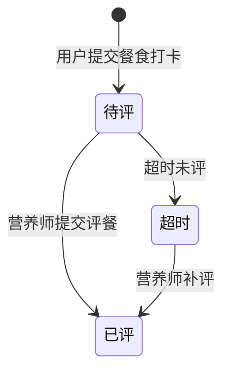

---

## 4. 咨询会话状态机

### 来源

- [后台原型-在线咨询]：`page-consultation`
- [后台原型-工作台]：`page-dashboard`（待回咨询告警）

### 状态定义

| 状态 | 类型 | 说明 |
|------|------|------|
| `进行中` | 推断状态 | 用户与营养师的会话处于活跃状态 |
| `待回复` | 显式状态 | 用户发送消息后，存在未读/未回复消息；会话列表显示未读计数 badge-red；Dashboard 显示"5 条未回复" |
| `已回复` | 推断状态 | 营养师已回复最新消息，无未读 |
| `已结束` | 推断状态 | 会话关闭/服务期结束 |

### 触发事件

| 事件 | 从状态 | 到状态 |
|------|--------|--------|
| 用户发起咨询 | `无会话` | `进行中` |
| 用户发送消息 | `已回复` | `待回复` |
| 用户发送消息 | `进行中` | `待回复` |
| 营养师回复消息 | `待回复` | `已回复` |
| 会话关闭/服务到期 | `已回复` | `已结束` |
| 会话关闭/服务到期 | `待回复` | `已结束` |

### 约束规则

1. `待回复` 和 `已回复` 本质上描述的是"最新一条消息的回复状态"，建议底层使用 `hasUnread` 布尔标记 + `lastMessageAt` 时间戳来推导，而非独立状态字段。
2. Dashboard 中的"待回咨询：5 条未回复"对应 `hasUnread = true` 的会话数。
3. 会话内营养师可"发送方案"和"发送报告"——这两个操作不改变会话状态本身，只产生会话内消息卡片。

### Mermaid

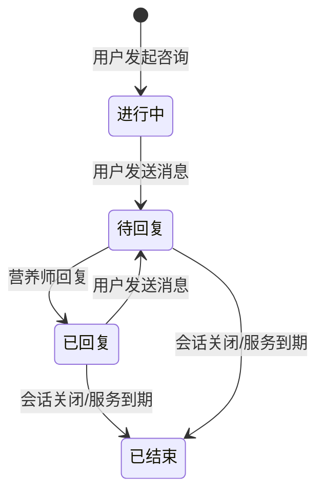

---

## 5. 阶段报告状态机

### 来源

- [后台原型-阶段报告]：`page-reports`

### 状态定义

| 状态 | 类型 | 说明 |
|------|------|------|
| `草稿` | 显式状态 | 报告已创建但未提交审核；列表 badge-gray；显示"编辑""生成"按钮 |
| `待审核` | 显式状态 | 报告已提交等待审核；列表 badge-yellow；显示"编辑"按钮 |
| `已发布` | 显式状态 | 报告审核通过并发布；列表 badge-green；显示"查看""下载PDF"按钮 |
| `已驳回` | 推断状态 | 审核不通过，报告退回草稿；原型未直接展示此态，但"待审核 → 草稿"的回退逻辑需此状态 |

### 触发事件

| 事件 | 从状态 | 到状态 |
|------|--------|--------|
| 创建报告 | `无记录` | `草稿` |
| 生成报告并提交审核 | `草稿` | `待审核` |
| 审核通过并发布 | `待审核` | `已发布` |
| 审核驳回 | `待审核` | `草稿`（含驳回意见） |
| 已发布报告修改（生成新版本） | `已发布` | `草稿` |

### 约束规则

1. 筛选条件支持「全部营养师」「全部类型（周报/月报/自定义）」「全部状态（草稿/已发布/待审核）」——营养师和报告类型为属性维度，不参与本状态机。
2. `草稿` 态的"生成"按钮触发报告内容由系统自动填充，但状态仍保持 `草稿`，直到营养师手动点击提交审核。
3. `已发布` 后如有修改需求，建议新建版本（`已发布` → `草稿`），而非直接修改已发布版本。

### Mermaid

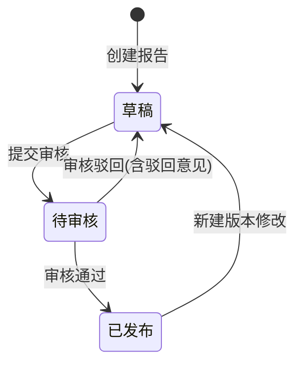

---

## 6. 方案模板状态机

### 来源

- [后台原型-方案管理]：`page-plan-mgmt`
- [后台原型-方案管理弹窗]：`modal-plan-edit`、`modal-plan-push`

### 状态定义

| 状态 | 类型 | 说明 |
|------|------|------|
| `已启用` | 推断状态 | 方案模板可用，可推送给用户；页面显示"使用中 N 人"badge-green |
| `已停用` | 推断状态 | 方案模板被管理员停用，不可再推送给新用户 |

### 触发事件

| 事件 | 从状态 | 到状态 |
|------|--------|--------|
| 创建方案模板 | `无记录` | `已启用` |
| 编辑方案模板 | `已启用` | `已启用`（属性变更，状态不变） |
| 停用方案模板 | `已启用` | `已停用` |
| 重新启用方案模板 | `已停用` | `已启用` |

### 约束规则

1. 方案模板本身只涉及 `已启用` / `已停用` 两个状态，相对简单。
2. 方案管理页显示的"86 已确认 / 12 待确认 / 3 超时未确认"是方案**推送后的确认回执统计**，属于 §2 用户方案实例状态机的 `待用户确认` 子维度。
3. 方案模板有类型属性（减重/增肌/维持），不参与状态迁移。
4. 向用户推送方案时触发的状态变化属于 §2 用户方案实例状态机（`系统生成中` → `待用户确认`），而非本状态机。

### Mermaid

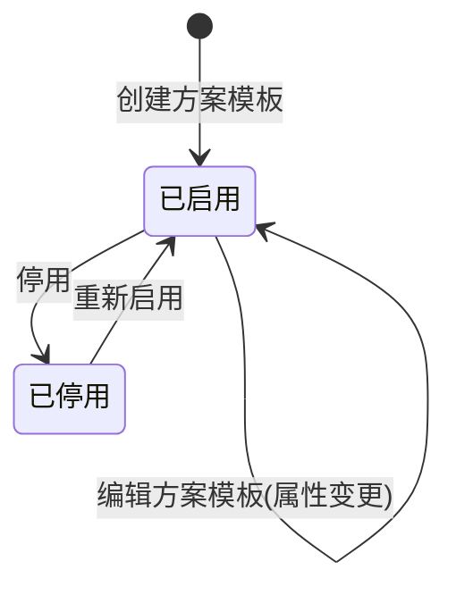

---

## 7. 营养师账号状态机

### 来源

- [后台原型-营养师管理]：`page-nutritionists`
- [后台原型-营养师管理弹窗]：`modal-nutri-add`、`modal-assign-users`

### 状态定义

| 状态 | 类型 | 说明 |
|------|------|------|
| `在线` | 显式状态 | 营养师当前在线可接咨询；列表 badge-green |
| `离线` | 显式状态 | 营养师未在线；列表 badge-gray |
| `已禁用` | 推断状态 | 管理员停用此营养师账号 |

### 触发事件

| 事件 | 从状态 | 到状态 |
|------|--------|--------|
| 新增营养师 | `无记录` | `离线`（默认） |
| 营养师上线 | `离线` | `在线` |
| 营养师下线 | `在线` | `离线` |
| 管理员禁用 | `在线` | `已禁用` |
| 管理员禁用 | `离线` | `已禁用` |
| 管理员启用 | `已禁用` | `离线` |

### 约束规则

1. `在线` / `离线` 是实时连接状态，建议由 WebSocket 心跳维护，而非持久化状态。`已禁用` 才是持久化的账号状态。
2. 建议将"在线/离线"与"已禁用"拆分为两条独立的标记字段：`connectionStatus`（实时，不落库）和 `accountStatus`（持久化枚举值：`ACTIVE` / `DISABLED`）。
3. 营养师职级（高级/中级/初级）和擅长方向是属性字段，不参与本状态机。

### Mermaid

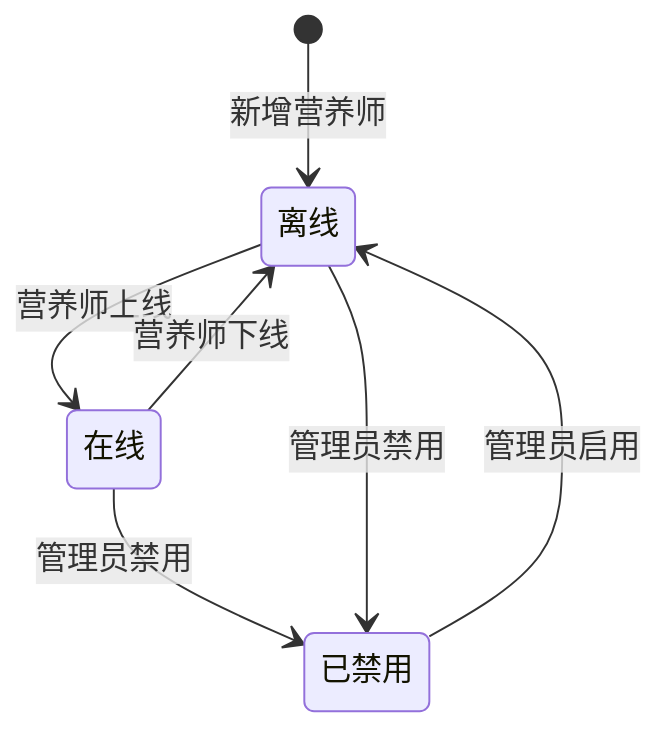

---

## 8. 消息推送记录状态机

### 来源

- [后台原型-消息推送中心]：`page-push-center`

### 状态定义

| 状态 | 类型 | 说明 |
|------|------|------|
| `待发送` | 推断状态 | 定时推送任务已创建但尚未到发送时间 |
| `已发送` | 推断状态 | 消息已推送 |
| `发送成功` | 显式状态 | 推送完成且成功送达；记录列表 badge-green |
| `发送失败` | 推断状态 | 推送完成但送达失败 |

### 触发事件

| 事件 | 从状态 | 到状态 |
|------|--------|--------|
| 创建推送任务 | `无记录` | `待发送` |
| 到发送时间，执行推送 | `待发送` | `已发送` |
| 推送通道返回成功 | `已发送` | `发送成功` |
| 推送通道返回失败 | `已发送` | `发送失败` |

### 约束规则

1. 消息推送中心页面的各推送类型（餐食打卡提醒/评餐通知/方案更新/活动推送/健康预警/阶段报告）各有独立的启用/禁用开关，这些开关是**推送规则的属性**，不是推送记录的状态。
2. 推送记录的推送类型字段记录该条消息属于哪种类型（餐食打卡提醒/评餐通知等），这是属性字段而非状态。
3. 原型中仅展示了 `发送成功` 状态的推送记录，`发送失败` 和 `待发送` 为推断。

### Mermaid

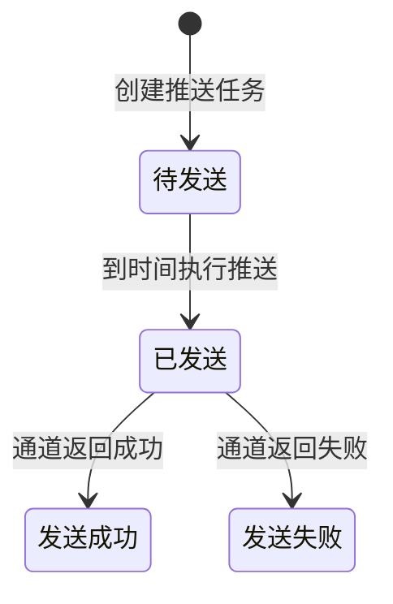

---

## 9. 健康建议模板状态机

### 来源

- [后台原型-规则配置中心]：`page-rules`（健康建议模板区域）

### 状态定义

| 状态 | 类型 | 说明 |
|------|------|------|
| `已启用` | 显式状态 | 模板生效中，参与系统健康建议生成；列表 badge-green |
| `已禁用` | 推断状态 | 模板被停用，不参与建议生成 |

### 触发事件

| 事件 | 从状态 | 到状态 |
|------|--------|--------|
| 创建模板 | `无记录` | `已启用` |
| 编辑模板 | `已启用` | `已启用`（属性变更，状态不变） |
| 禁用模板 | `已启用` | `已禁用` |
| 重新启用 | `已禁用` | `已启用` |

### 约束规则

1. 健康建议模板有优先级属性（高/中/低，分别对应 badge-red/yellow/blue），优先级是属性维度，不参与状态迁移。
2. 模板内容编辑不影响其启用/禁用状态。

### Mermaid

---

## 10. 异常预警规则状态机

### 来源

- [后台原型-规则配置中心]：`page-rules`（异常预警规则区域）

### 状态定义

| 状态 | 类型 | 说明 |
|------|------|------|
| `已启用` | 显式状态 | 预警规则生效；开关打开（rule-switch on） |
| `已禁用` | 显式状态 | 预警规则停用；开关关闭（rule-switch off） |

### 触发事件

| 事件 | 从状态 | 到状态 |
|------|--------|--------|
| 创建预警规则 | `无记录` | `已启用` |
| 关闭预警规则 | `已启用` | `已禁用` |
| 重新开启预警规则 | `已禁用` | `已启用` |

### 约束规则

1. Dashboard 中显示的"李芳连续 3 天体重反弹"等异常告警是预警规则被触发后产生的**告警记录**，不是本状态机的状态。告警记录本身建议独立建模（如：告警记录有「已触发/已查看/已处理」等状态）。
2. 每条预警规则有独立的阈值和条件配置，这些是属性字段。

### Mermaid

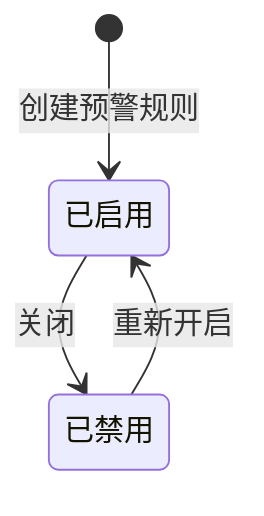

---

## 11. 角色状态机

### 来源

- [后台原型-角色权限]：`page-roles`

### 状态定义

| 状态 | 类型 | 说明 |
|------|------|------|
| `已启用` | 显式状态 | 角色生效；列表 badge-green |
| `已禁用` | 推断状态 | 角色被停用 |

### 触发事件

| 事件 | 从状态 | 到状态 |
|------|--------|--------|
| 创建角色 | `无记录` | `已启用` |
| 编辑权限矩阵 | `已启用` | `已启用`（属性变更，状态不变） |
| 禁用角色 | `已启用` | `已禁用` |
| 重新启用 | `已禁用` | `已启用` |

### 约束规则

1. 每个角色内部包含多个权限项的开关（开启/关闭），权限项是角色的**属性集合**，不参与角色本身的状态机。
2. 仅对 `已启用` 角色可执行「编辑权限」操作。

### Mermaid

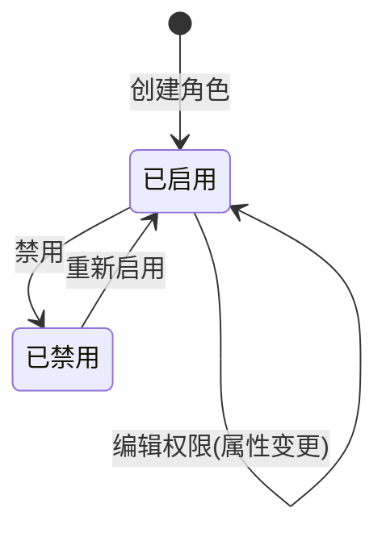

---

## 12. 食物/运动库条目状态机

### 来源

- [后台原型-系统设置]：`page-settings`（食物库/运动库区域）
- [后台原型-系统设置弹窗]：`modal-item-add`

### 状态定义

| 状态 | 类型 | 说明 |
|------|------|------|
| `已上架` | 推断状态 | 条目可用，用户端可供选择 |
| `已下架` | 推断状态 | 条目被管理员下架，用户端不再显示 |

### 触发事件

| 事件 | 从状态 | 到状态 |
|------|--------|--------|
| 添加食物/运动类型 | `无记录` | `已上架` |
| 下架条目 | `已上架` | `已下架` |
| 重新上架 | `已下架` | `已上架` |

### 约束规则

1. 原型中食物库和运动库只展示了添加入口（`modal-item-add` 弹窗），未展示条目列表和状态管理。本状态机为推断，建议产品补充条目管理页面。
2. 食物条目含属性：名称、分类（主食/肉蛋/蔬菜/水果/饮品/乳制品/零食）、热量、蛋白质、碳水、脂肪。
3. 运动条目含属性：名称、MET 值、默认时长、适用人群（全部/初级/中级/高级）。

### Mermaid

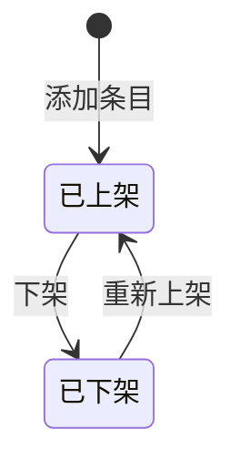

---

## 13. 系统配置开关状态机

### 来源

- [后台原型-系统设置]：`page-settings`

### 适用对象

系统设置页面中的以下配置项组（均为简单二元开关，统一建模）：

1. 消息推送配置：微信订阅消息、打卡提醒 20:00、评餐通知、App Push
2. 客户端展示位配置：首页健康预警卡片、首页达标率展示、营养师页评餐 Tab、营养师页方案报告 Tab
3. 打卡日历配置：补卡计入达标、连续打卡成就
4. 规则配置中心配置：极端目标拦截开关
5. 异常预警规则开关（见 §10，独立状态机但也可归为此类）

### 状态定义

| 状态 | 类型 | 说明 |
|------|------|------|
| `开启` | 显式状态 | rule-switch on，功能生效 |
| `关闭` | 显式状态 | rule-switch off，功能不生效 |

### 触发事件

| 事件 | 从状态 | 到状态 |
|------|--------|--------|
| 打开开关 | `关闭` | `开启` |
| 关闭开关 | `开启` | `关闭` |

### 约束规则

1. 所有系统配置开关均为独立配置项，互不影响。每个开关对应数据库一条配置记录。
2. 配置变更建议记录操作日志（操作人、操作时间、变更前后值）。
3. 部分开关之间可能存在业务依赖（如"补卡计入达标"依赖于"打卡日历"功能整体开启），依赖关系建议在 PRD 中明确。

### Mermaid

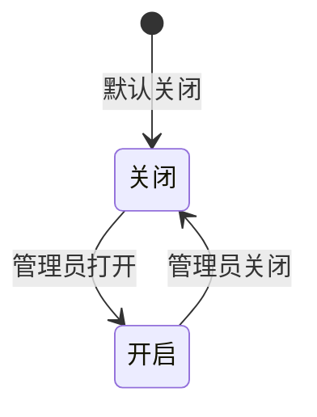

---

## 推荐的统一状态字段命名

为了避免前后端和数据分析口径不一致，建议把显示态与存储态分开：

### 显示态

用于页面标签，尽量贴近业务语言：

1. `暂不减重`
2. `方案执行中`
3. `已达标`
4. `已流失`
5. `待评` / `超时` / `已评`
6. `待回复` / `已回复`
7. `草稿` / `待审核` / `已发布`
8. `在线` / `离线`
9. `已启用` / `已停用`
10. `已上架` / `已下架`
11. `开启` / `关闭`

### 存储态

用于数据库与接口枚举，建议使用稳定英文常量：

| 中文状态 | 建议枚举 | 适用对象 |
|----------|----------|----------|
| 暂不减重 | `IDLE` | 用户 |
| 方案执行中 | `PLAN_ACTIVE` | 用户 |
| 已达标 | `ACHIEVED` | 用户 |
| 已流失 | `CHURNED` | 用户 |
| 系统生成中 | `PLAN_GENERATING` | 用户方案实例 |
| 待用户确认 | `WAIT_CONFIRM` | 用户方案实例 |
| 执行中 | `IN_PROGRESS` | 用户方案实例 |
| 调整中 | `ADJUSTING` | 用户方案实例 |
| 调整后待确认 | `ADJUST_WAIT_CONFIRM` | 用户方案实例 |
| 已完成 | `COMPLETED` | 用户方案实例 |
| 待评 | `PENDING_REVIEW` | 评餐记录 |
| 超时 | `OVERTIME` | 评餐记录 |
| 已评 | `REVIEWED` | 评餐记录 |
| 待回复 | `WAIT_REPLY` | 咨询会话 |
| 已回复 | `REPLIED` | 咨询会话 |
| 已结束 | `CLOSED` | 咨询会话 |
| 草稿 | `DRAFT` | 阶段报告 |
| 待审核 | `PENDING_AUDIT` | 阶段报告 |
| 已发布 | `PUBLISHED` | 阶段报告 |
| 已驳回 | `REJECTED` | 阶段报告 |
| 已启用 | `ENABLED` | 方案模板 / 健康建议模板 / 异常预警规则 / 角色 |
| 已停用 | `DISABLED` | 方案模板 / 健康建议模板 / 异常预警规则 / 角色 |
| 在线 | `ONLINE` | 营养师连接态 |
| 离线 | `OFFLINE` | 营养师连接态 |
| 账号已禁用 | `ACCOUNT_DISABLED` | 营养师账号持久态 |
| 待发送 | `PENDING_SEND` | 推送记录 |
| 发送成功 | `SENT_SUCCESS` | 推送记录 |
| 发送失败 | `SENT_FAILED` | 推送记录 |
| 已上架 | `PUBLISHED` | 食物/运动库条目 |
| 已下架 | `UNPUBLISHED` | 食物/运动库条目 |
| 开启 | `ON` | 系统配置开关 |
| 关闭 | `OFF` | 系统配置开关 |

---
