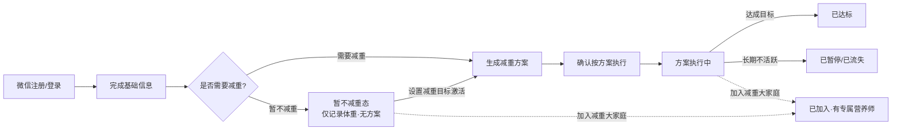
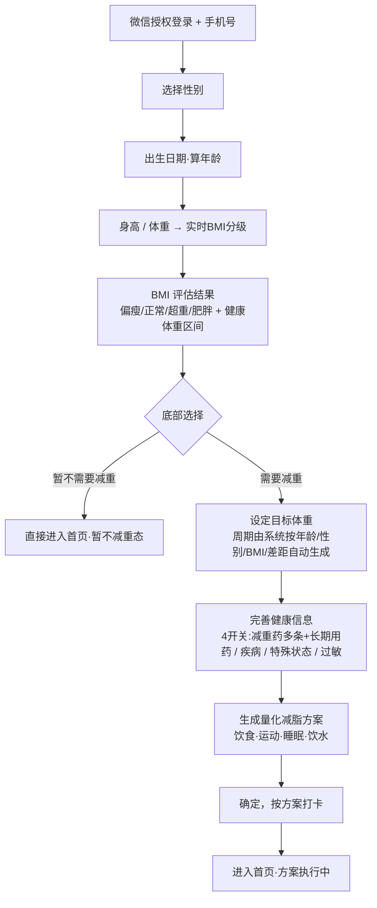
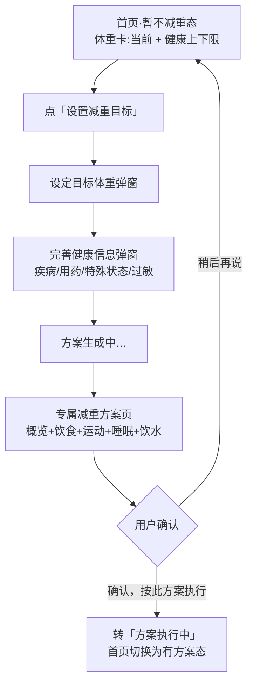
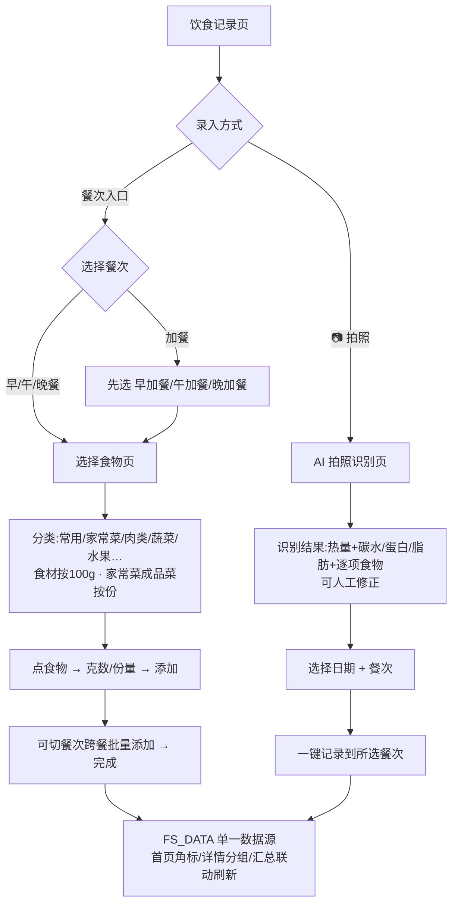
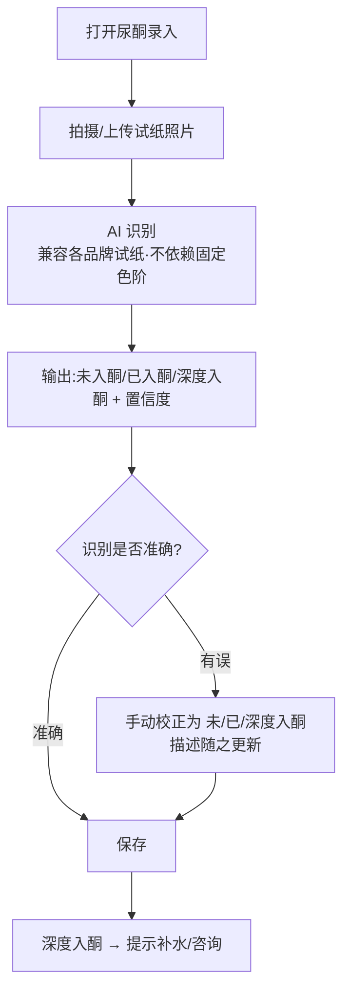
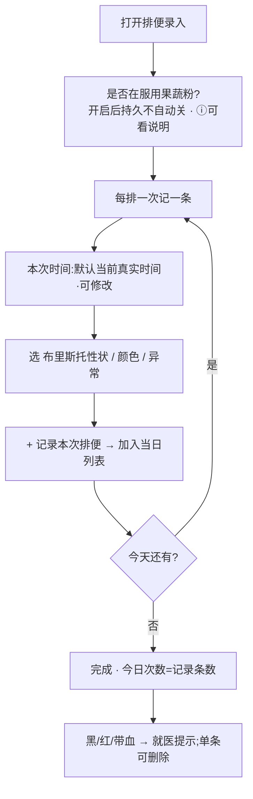
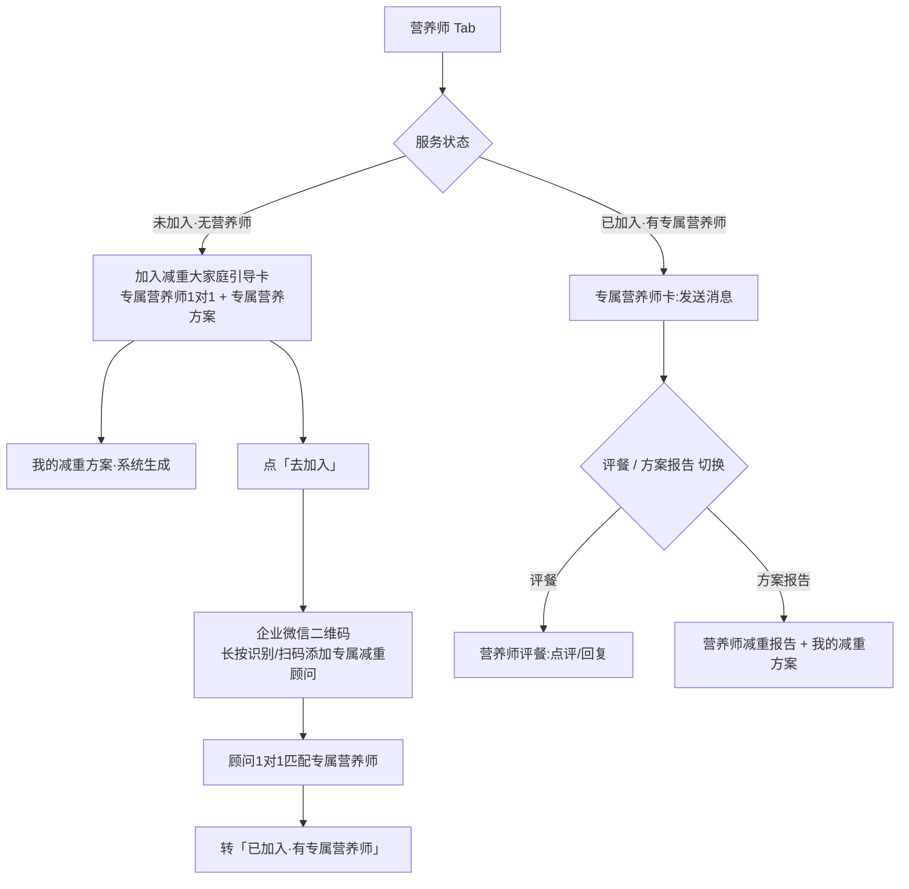
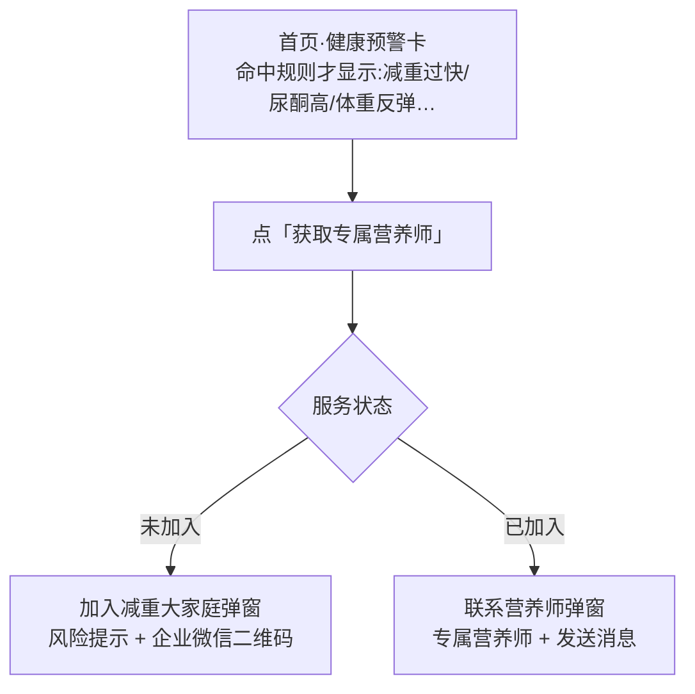
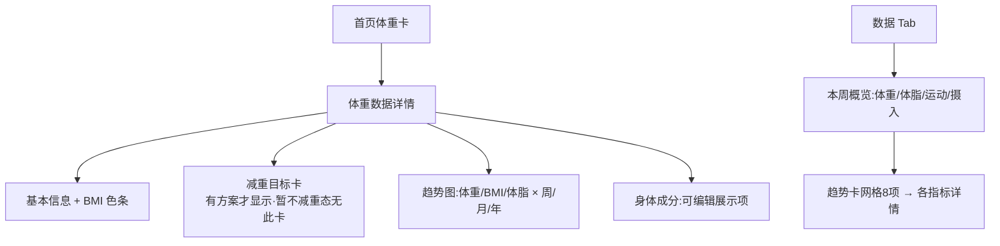
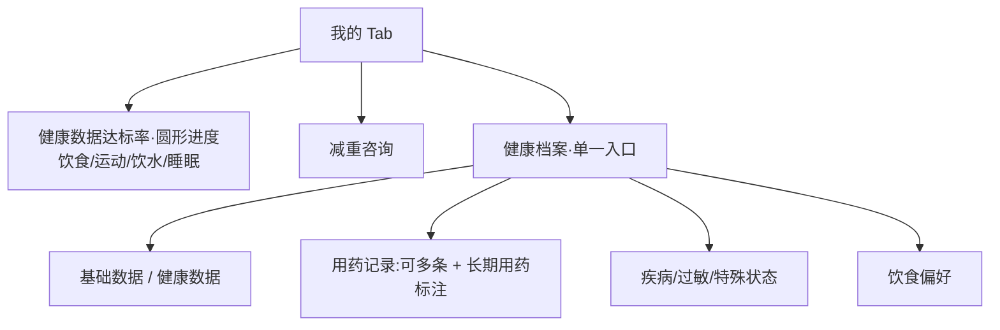

# 用户使用流程 · 用户端（小程序）

> 版本：V1.0　日期：2026-06-05
> 范围：新菘福减重小程序用户端，按场景拆解的使用流程
> 图示：Mermaid 流程图（GitHub / Typora / VSCode 可直接渲染）
> 关键状态：**减重状态**（暂不减重 / 方案执行中 / 已达标 / 已暂停 / 已流失）× **服务状态**（未加入·无营养师 / 已加入·有专属营养师）

---

## 0. 全局状态机（用户生命周期）



- **服务状态**与减重状态正交：无论是否减重，用户初始都是「未加入·无营养师」；加入减重大家庭后变「已加入」。
- 后台据此分配专属营养师、推送营养师报告、开通评餐与在线咨询。

---

## 1. 场景一：首次进入 · 登录引导（8 步）



**关键规则**
- 目标 BMI<18 弹偏瘦风险提示；用药区脚注"平台不提供药物推荐，仅作健康档案记录"。
- 选"暂不减重"跳过目标/方案步骤，进入无方案首页（见场景二）。

---

## 2. 场景二：暂不减重用户 · 后续激活减重方案



---

## 3. 场景三：每日打卡（核心高频）

```mermaid
flowchart TD
  H[首页·每日打卡卡] --> CAL{选择日期}
  CAL -- 今天 --> T[当日打卡]
  CAL -- 左右滑动选过去日 --> M[补卡态:提示"正在为X月X日补卡"]
  T --> P{选择打卡项}
  M --> P
  P --> P1[🍽️ 饮食热量 → 见场景四]
  P --> P2[⚖️ 体重:手动/蓝牙秤/拍照 + 体脂 + 三围]
  P --> P3[📏 三围:腰必填/臀/腹]
  P --> P4[🧪 尿酮 → 见场景五]
  P --> P5[🚽 排便 → 见场景六]
  P --> P6[😴 睡眠 / 🏃 运动 / 💧 饮水 / 🩸 生理期]
  P1 & P2 & P3 & P4 & P5 & P6 --> R[保存 → 刷新打卡徽章/状态色点]
```

**关键规则**
- 日期条最近 14 天可滑动，状态色点：合适(绿)/吃多(红)/吃少(琥珀)/未打卡(无)。
- 补卡受后台「补卡规则」约束（允许补卡天数/是否计入达标）。

---

## 4. 场景四：饮食记录 · 选食物 / AI 拍照



---

## 5. 场景五：尿酮打卡（AI 识别）



> 因各厂家试纸色阶不统一，改由 AI 拍照判定；低置信度后台会提示人工校正。

---

## 6. 场景六：排便打卡（按次记录）



---

## 7. 场景七：营养师页 · 加入减重大家庭



**关键规则**
- 未加入用户：只有系统生成的「我的减重方案」，**无系统单独报告**；评餐/营养师报告/在线咨询都属加入后服务。
- 加入即企业微信引流 → 后台分配专属营养师。

---

## 8. 场景八：健康预警 → 联系营养师 / 加入



---

## 9. 场景九：数据查看（趋势/详情）



---

## 10. 场景十：我的 / 健康档案



---

## 附：场景与底部导航对应

| 底部 Tab | 主要场景 |
|---|---|
| 首页 | 每日打卡(3)、补卡、体重详情(9)、健康预警(8) |
| 数据 | 数据查看(9) |
| ➕(中间) | 饮食记录/拍照(4)、各项录入(3/5/6) |
| 营养师 | 加入减重大家庭/评餐/报告(7) |
| 我的 | 健康档案/达标率(10) |

> 说明：各流程均已在原型 `6.小程序原型/standalone_optimized/`（及合并版 `新菘福-小程序-合并版.html`）实现，可对照演示。
